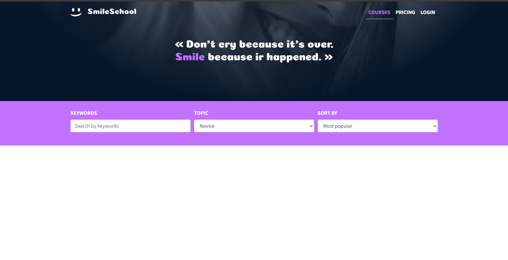
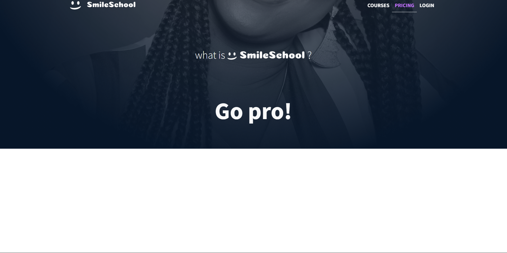

# ALU Smiling School
> Implementing a design with Bootstrap

## 📖 Description

This project is an implementation of a responsive web design for the ALU Smiling School using Bootstrap. The goal is to create fully functional web pages that match the designer's specifications, incorporating HTML, CSS, accessibility, and responsive design principles.

The website showcases the school's offerings, including courses, pricing, and general information. It adapts seamlessly to different screen sizes: desktop, tablet (768px), and mobile (576px).

*Designed by Jesse Kisaale Walusansa.*

## 🌟 Features

- **Responsive Design**: Optimized for desktop, tablet, and mobile devices.
- **Bootstrap Integration**: Utilizes Bootstrap classes for layout and components.
- **Accessibility**: Ensures web accessibility standards are met.
- **Multiple Pages**:
  - Homepage: Introduction and overview.
  - Courses: Detailed course listings.
  - Pricing: Pricing plans and information.
- **Interactive Elements**: Includes carousels, testimonials, and navigation.

## 🛠️ Technologies Used

- **HTML5**: Structure and content.
- **CSS3**: Styling and layout.
- **Bootstrap 4/5**: Framework for responsive design.
- **Figma**: For design reference.

## 🚀 Installation

1. Clone the repository:
   ```bash
   git clone https://github.com/jessewalu
   ```
2. Navigate to the project directory:
   ```bash
   cd alu-smiling-school
   ```
3. Open `homepage.html` in your preferred web browser.

No additional dependencies or build steps are required as this is a static website.

## 📱 Usage

- **Homepage**: Start here for an overview of the school.
- **Courses**: Browse available courses and instructors.
- **Pricing**: View pricing options.

Simply open the respective HTML files in a browser to view the pages.

## 📸 Screenshots

### Homepage


### Courses Page


### Pricing Page


## 🤝 Contributing

Contributions are welcome! Please follow these steps:

1. Fork the repository.
2. Create a new branch for your feature.
3. Make your changes.
4. Test thoroughly.
5. Submit a pull request.

## 📄 License

This project is licensed under the MIT License. See the [LICENSE](LICENSE) file for details.

## 👤 Author

- **Jesse Kisaale Walusansa** - [GitHub](https://github.com/jessewalu)

## 📞 Contact

For questions or feedback, please open an issue on GitHub.

---

*Project Notes:*
- Familiarize yourself with Figma for design accuracy.
- Use Bootstrap classes extensively.
- Pages switch to tablet view at 768px width.
- Pages switch to mobile view at 576px width.
- Maintain a simple HTML structure.

